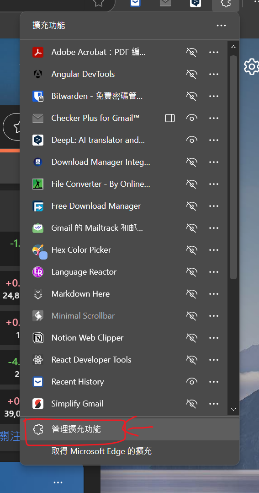
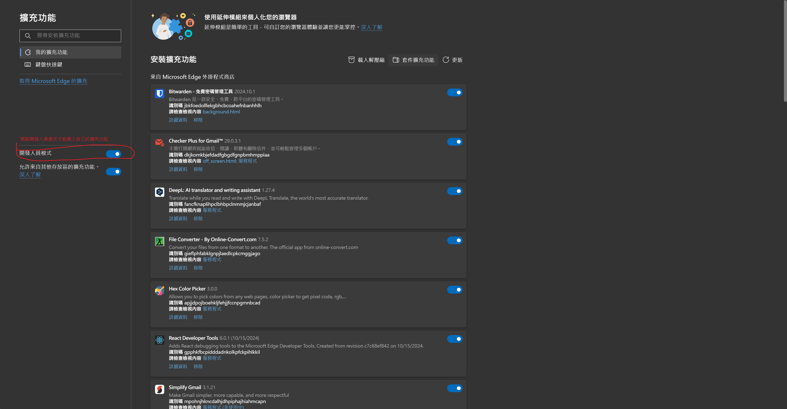
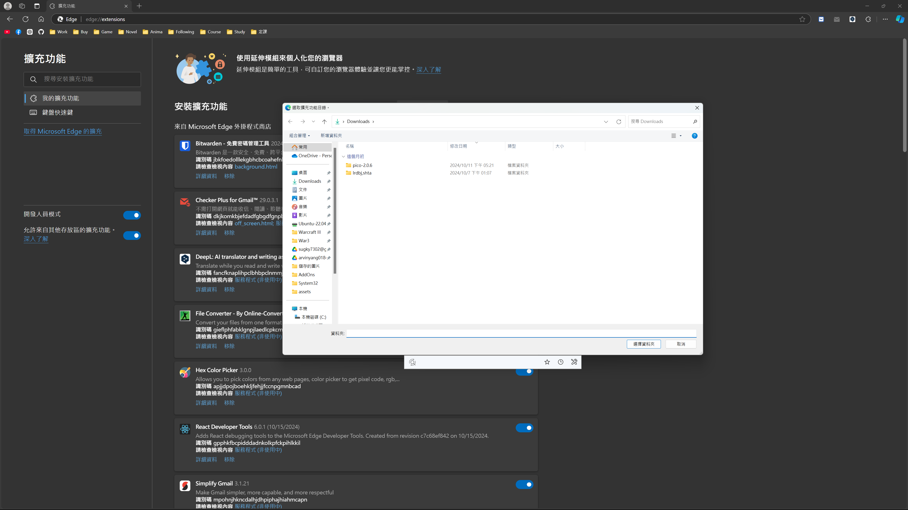
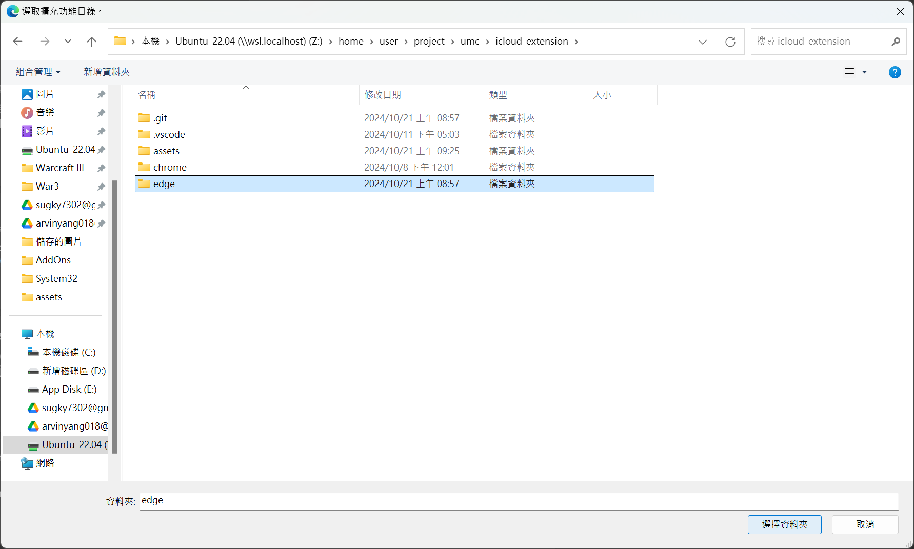
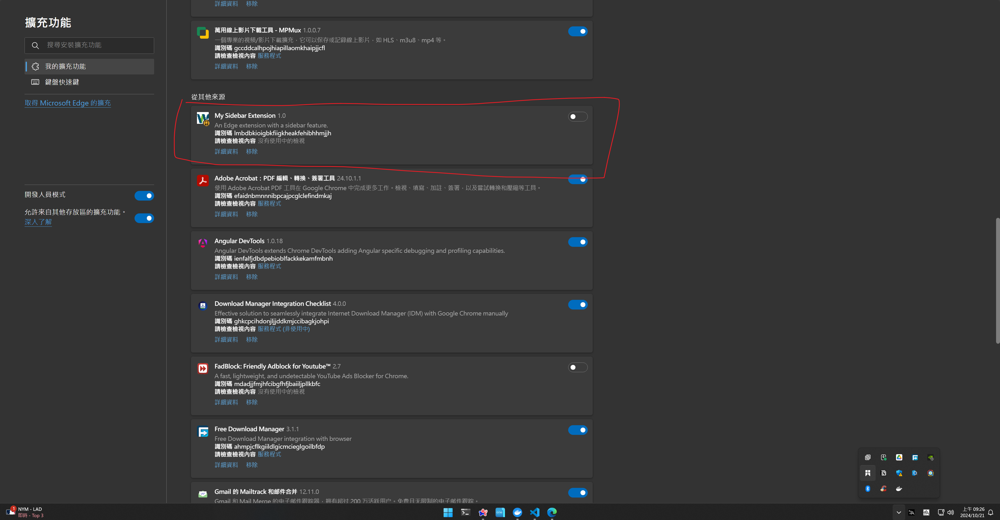

# iCloud 擴充套件

## 如何開發
1. 於 Docker 容器建置後，請手動 `pnpm install` 安裝依賴。
2. 每次要測試時，請先執行 `pnpm run build`。

## 如何安裝擴充套件
1. 打開 Edge 瀏覽器，點選右上角的三個點點。

2. 選取「擴充功能」。

3. 點擊「管理擴充功能」。

4. 因為目前還沒上架，必須打開「開發人員模式」才能導入自己的擴充功能。

5. 點選「載入解壓縮」。

6. 選擇要載入的資料夾或者壓縮檔。

7. 往下滑到「從其他來源」，就能找到我們的套件。
